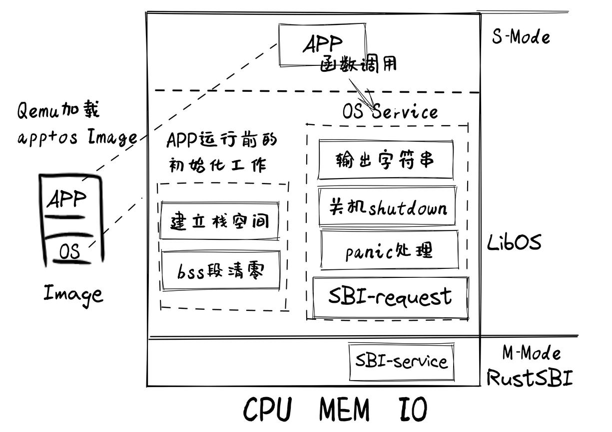
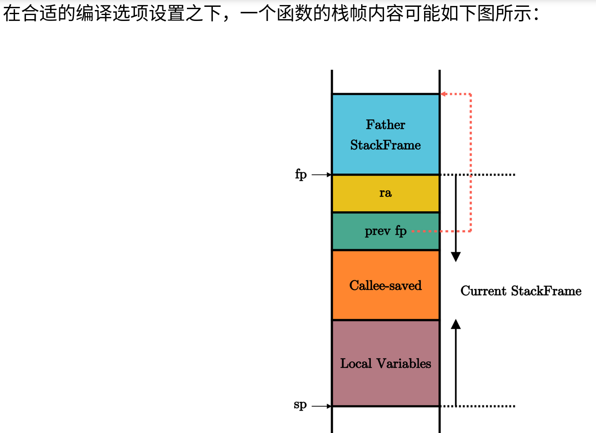
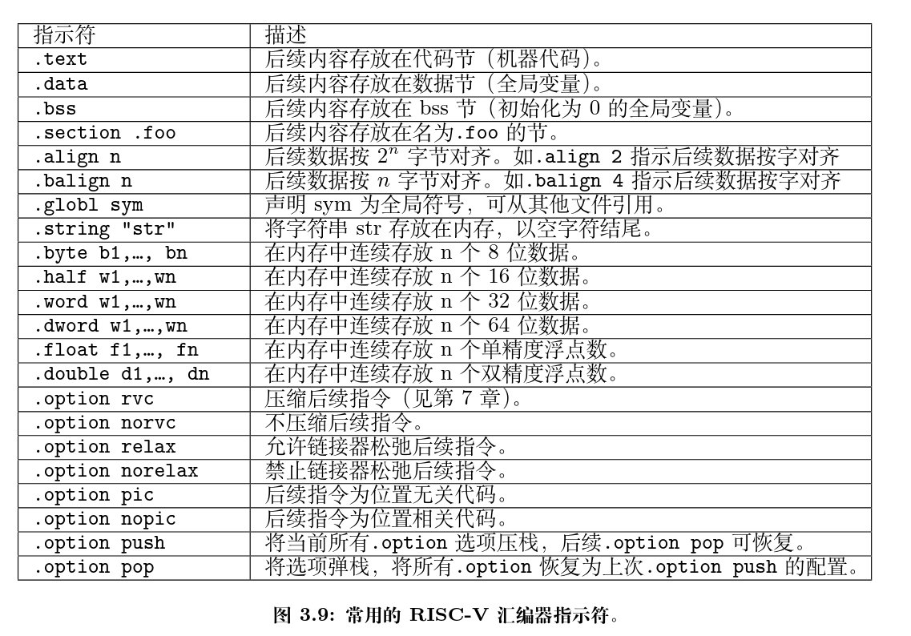

[对操作系统启动很重要的讲解](https://rcore-os.cn/rCore-Tutorial-Book-v3/chapter1/3first-instruction-in-kernel1.html#)



```bash
$ file target/riscv64gc-unknown-none-elf/debug/os
> target/riscv64gc-unknown-none-elf/debug/os: ELF 64-bit LSB executable, UCB RISC-V, RVC, double-float ABI, version 1 (SYSV), statically linked, with debug_info, not stripped
> # 可以看出这是个合法的RV64二进制程序
$ rust-readobj -h target/riscv64gc-unknown-none-elf/debug/os
> File: target/riscv64gc-unknown-none-elf/debug/os
Format: elf64-littleriscv
Arch: riscv64
AddressSize: 64bit
LoadName: <Not found>
ElfHeader {
  Ident {
    Magic: (7F 45 4C 46)
    Class: 64-bit (0x2)
    DataEncoding: LittleEndian (0x1)
    FileVersion: 1
    OS/ABI: SystemV (0x0)
    ABIVersion: 0
    Unused: (00 00 00 00 00 00 00)
  }
  Type: Executable (0x2)
  Machine: EM_RISCV (0xF3)
  Version: 1
  Entry: 0x0
  ProgramHeaderOffset: 0x40
  SectionHeaderOffset: 0x1878
  Flags [ (0x5)
    EF_RISCV_FLOAT_ABI_DOUBLE (0x4)
    EF_RISCV_RVC (0x1)
  ]
  HeaderSize: 64
  ProgramHeaderEntrySize: 56
  ProgramHeaderCount: 4
  SectionHeaderEntrySize: 64
  SectionHeaderCount: 12
  StringTableSectionIndex: 10
}
> # 尽管合法 但是rust-readobj 工具告诉我们它的入口地址 `23:`Entry 是 0

> # 反汇编处理之后：
$ rust-objdump -S target/riscv64gc-unknown-none-elf/debug/os
> target/riscv64gc-unknown-none-elf/debug/os:     file format elf64-littleriscv
> # 但它是一个空程序，原因是缺少了编译器规定的入口函数 _start 。
```

```ld
.ld:链接obj文件的链接器

OUTPUT_ARCH(riscv)
设置平台为riscv
ENTRY(_start)
定义程序的入口点
BASE_ADDRESS = 0x80200000;
内核初始化，代码放置的位置

SECTIONS
{
    . = BASE_ADDRESS;
    .表示当前位置


    ------------------------------------
    skernel = .;        内核开始读
    ...
    --------------------------
    stext = .;      代码段开始读
    
    1. 注意：.text.entry 段放在最终的 .text 段的最开头
    2. 同时注意到代码段 .text 又是先于任何其他段的。
    
    .text : { 
    可执行文件段名 : {}
        *(.text.entry)
        1. obj文件[*通配符](段名称) 
        2. 放入上面可执行文件段名中
        *(.text .text.*)

    }

    这个代码的意思：
    1.优先匹配所有的.text.entry段，放入.text段中
    2.匹配.text段
    3.匹配.text.*的段:比如.text.foo

在选中的代码中，.srodata 和 rodata 的区别在于它们的作用域和链接方式。

1. .rodata 区域中的数据默认是只读的，
2. .srodata 区域中的数据默认是可读可写的。。

    . = ALIGN(4K);      
    1. ALIGN是个函数;
    2.他不是移动里面的字节
    3.他是保证当前的位置是4K的倍数，不会翻页
    etext = .;      代码段读完   
    --------------------------
    ...
    ekernel = .;        内核结束
    ------------------------------------

    /DISCARD/ : {
        *(.eh_frame)
    }
}
```


ELF相当于win的可执行文件：

让我们看看ELF 元数据里面放的都是啥：

- ELF Header

```bash
File: target/debug/os
Format: elf64-x86-64
Arch: x86_64
AddressSize: 64bit
LoadName:
ElfHeader {
Ident {
   Magic: (7F 45 4C 46)
   Class: 64-bit (0x2)
   DataEncoding: LittleEndian (0x1)
   FileVersion: 1
   OS/ABI: SystemV (0x0)
   ABIVersion: 0
   Unused: (00 00 00 00 00 00 00)
}
Type: SharedObject (0x3)
Machine: EM_X86_64 (0x3E)
Version: 1
Entry: 0x5070
ProgramHeaderOffset: 0x40
SectionHeaderOffset: 0x32D8D0
Flags [ (0x0)
]
HeaderSize: 64
ProgramHeaderEntrySize: 56
ProgramHeaderCount: 12
SectionHeaderEntrySize: 64
SectionHeaderCount: 42
StringTableSectionIndex: 41
}
......
```

- 第 8 行是一个称之为 **魔数** (Magic) 独特的常数，存放在 ELF header 的一个固定位置。当加载器将 ELF 文件加载到内存之前，通常会查看 该位置的值是否正确，来快速确认被加载的文件是不是一个 ELF 。
- 第 19 行给出了可执行文件的入口点为 `0x5070` 。
- 从 20-21 行中，我们可以知道除了 ELF header 之外，还有另外两种不同的 header，分别称为 program header 和 section header， 它们都有多个。ELF header 中给出了其他两种header 的大小、在文件中的位置以及数目。
- 从 24-27 行中，可以看到有 12 个不同的 program header，它们从文件的 0x40 字节偏移处开始，每个 56 字节； 有64个section header,它们从文件的 0x2D8D0 字节偏移处开始，每个 64 字节；

有多个不同的 section header，下面是个具体的例子：

```
......
Section {
   Index: 14
   Name: .text (157)
   Type: SHT_PROGBITS (0x1)
   Flags [ (0x6)
      SHF_ALLOC (0x2)
      SHF_EXECINSTR (0x4)
   ]
   Address: 0x5070
   Offset: 0x5070
   Size: 208067
   Link: 0
   Info: 0
   AddressAlignment: 16
   EntrySize: 0
}
```

每个 section header 则描述一个段的元数据。

其中，我们看到了代码段 `.text` 需要被加载到地址 `0x5070` ，大小 208067 字节。 它们分别由元数据的字段 Offset、 Size 和 Address 给出。

我们还能够看到程序中的符号表：

```
Symbol {
  Name: _start (37994)
  Value: 0x5070
  Size: 47
  Binding: Global (0x1)
  Type: Function (0x2)
  Other: 0
  Section: .text (0xE)
}
 Symbol {
    Name: main (38021)
    Value: 0x51A0
    Size: 47
    Binding: Global (0x1)
    Type: Function (0x2)
    Other: 0
    Section: .text (0xE)
 }
```

里面包括了我们写的 `main` 函数的地址以及用户态执行环境的起始地址 `_start` 函数的地址。

因此，从 ELF header 中可以看出，ELF 中的内容按顺序应该是：

- ELF header
- 若干个 program header
- 程序各个段的实际数据
- 若干的 section header


#### 得到内核镜像

```
rust-objcopy --strip-all target/riscv64gc-unknown-none-elf/release/os -O binary target/riscv64gc-unknown-none-elf/release/os.bin

stat 工具来比较内核可执行文件和内核镜像的大小

stat target/riscv64gc-unknown-none-elf/release/os

这些元数据能够帮助我们更加灵活地加载并使用可执行文件，比如在加载时完成一些重定位工作或者动态链接
但是qemu不允许动态链接，所以我们不用动态库


```


启动Qemu:

```bash
qemu-system-riscv64 \
    -machine virt \
    -nographic \
    -bios ../bootloader/rustsbi-qemu.bin \
    -device loader,file=target/riscv64gc-unknown-none-elf/release/os.bin,addr=0x80200000 \
    -s -S
```

`-s` 可以使 Qemu 监听本地 TCP 端口 1234 等待 GDB 客户端连接，而 `-S `可以使 Qemu 在收到 GDB 的请求后再开始运行。因此，Qemu 暂时没有任何输出。注意，如果**不想**通过 GDB 对于 Qemu 进行调试而是直接运行 Qemu 的话，则要删掉最后一行的 -s -S 。

打开另一个终端，启动一个 GDB 客户端连接到 Qemu ：

```bash
riscv64-unknown-elf-gdb \
    -ex 'file target/riscv64gc-unknown-none-elf/release/os' \
    -ex 'set arch riscv:rv64' \
    -ex 'target remote localhost:1234'
```


```gdb
x/10i $pc:从pc位置反汇编10个指令

si 可以让 Qemu 每次向下执行一条指令，之后屏幕会打印出待执行的下一条指令的地址

p/x $t0 以 16 进制打印寄存器 t0 的值，注意当我们要打印寄存器的时候需要在寄存器的名字前面加上 $ 

b *0x80200000:在此处打上断点

c运行到断点
```

1. 在GDB中，`x` 是一个命令，用于检查内存。具体来说，`x` 命令后面可以跟一些参数来指定如何显示内存内容 

2. i指令

当数据为 0 的时候则会被反汇编为 `unimp` 指令。


## 调用函数

上一节我们成功在 Qemu 上执行了内核的第一条指令，它是我们在 `entry.asm` 中手写汇编代码得到的。然而，我们无论如何也不想仅靠手写汇编代码的方式编写我们的内核，绝大部分功能我们都想使用 Rust  语言来实现。不过**为了将控制权转交给我们使用 Rust  语言编写的内核入口函数，我们确实需要手写若干行汇编代码进行一定的初始化工作**。和之前一样，这些汇编代码放在 `entry.asm` 中，并在控制权被转交给内核相关函数前最先被执行，但它们的功能会更加复杂。

Rust底层是汇编语言？所以直接汇编语言转换了？

### 栈空间设置

来在内核内使能函数调用，随后直接调用使用 Rust 编写的内核入口函数，从而控制权便被移交给 Rust 代码

函数调用上下文分成两类：可以让编译器尽可能早地优化掉一些无用的寄存器保存与恢复操作，提高程序的执行性能。



- `fp` -` sp`存储这个函数堆栈

- ra函数返回位置，指令的

- fp返回堆栈位置的
- callee-saved：被调用者保存寄存器（放在调用者那边，就是调用者寄存器）
- 被调用不会修改调用者寄存器，调用者保存寄存器储存函数调用才会用的寄存器
- local :公用寄存器

### 函数调用

```asm
# 开场
# 为当前函数分配 64 字节的栈帧
addi        sp, sp, -64
# 将 ra 和 fp 压栈保存
sd  ra, 56(sp)
sd  s0, 48(sp)
# 更新 fp 为当前函数栈帧顶端地址
addi        s0, sp, 64

# 函数执行
# 中间如果再调用了其他函数会修改 ra

# 结尾
# 恢复 ra 和 fp
ld  ra, 56(sp)
ld  s0, 48(sp)
# 退栈
addi        sp, sp, 64
# 返回，使用 ret 指令或其他等价的实现方式
ret
```

储存调用者的ra,fp

前面我们提到过 `.bss` 段一般放置需要被初始化为零的数据。然而栈并不需要在使用前被初始化为零，因为在函数调用的时候我们会插入栈帧覆盖已有的数据。我们尝试将其放置到全局数据 `.data` 段中但最后未能成功，因此才决定将其放置到 `.bss` 段中。

全局符号 `sbss` 和 `ebss` 分别指向 `.bss` 段除 `.bss.stack` 以外的起始和终止地址，我们在使用这部分数据之前需要将它们初始化为零，这个过程将在下一节进行。

```
.bss : {
    *(.bss.stack)
    sbss = .;
    *(.bss .bss.*)
    *(.sbss .sbss.*)
}
ebss = .;
```

我们编写的 OS 内核位于 Supervisor 特权级，而 RustSBI 位于 Machine 特权级，也是最高的特权级。类似 RustSBI 这样运行在 Machine 特权级的软件被称为 Supervisor Execution Environment(SEE)，即 Supervisor 执行环境。两层软件之间的接口被称为 Supervisor Binary Interface(SBI)，即 Supervisor 二进制接口。 SBI Specification （简称 SBI spec）规定了 SBI 接口层要包含哪些功能，该标准由 RISC-V 开源社区维护。RustSBI 按照 SBI spec 标准实现了需要支持的大多数功能，但 RustSBI 并不是 SBI 标准的唯一一种实现，除此之外还有社区中的前辈 OpenSBI 等等。

SEE向内核提供接口，

Error Type Value
SBI_SUCCESS 0
SBI_ERR_FAILED -1
SBI_ERR_NOT_SUPPORTED -2
SBI_ERR_INVALID_PARAM -3
SBI_ERR_DENIED -4
SBI_ERR_INVALID_ADDRESS -5
SBI_ERR_ALREADY_AVAILABLE -6
SBI_ERR_ALREADY_STARTED -7
SBI_ERR_ALREADY_STOPPED -8

# SBi提供println!服务
```Rust
导入外部宏
use crate::宏;

导出自己的宏给别人使用
在编写库时，如果你的库提供了宏供其他代码使用，
你可能需要在库的lib.rs文件的根级别上使用#[macro_export]属性，
而不是要求库的用户使用#[macro_use]。这样，库的用户就可以直接使用use语句来导入你的宏了。
```


```rust
macro_rules! capture_then_match_tokens {
    ($e:expr) => {
        match_tokens!($e);
    };
}
macro_rules! match_tokens {
    ($a:tt + $b:tt) => {"got an addition"};
    (($i:ident)) => {"got an identifier"};
    ($($other:tt)*) => {
        "got something else"
    };
}
fn main() {
    println!("{}\n{}\n{}\n",
        match_tokens!((caravan)),
        match_tokens!(3 + 6),
        match_tokens!(5));
    println!("{:?}\n{:?}\n{:?}",
        capture_then_match_tokens!((caravan)),
        capture_then_match_tokens!(3 + 6),
        capture_then_match_tokens!(5));
}

```

> output:
>
> got an identifier
> got an addition
> got something else
>
> "got something else"
> "got something else"
> "got something else"

由于`capture_then_match_tokens`里面的`$e:expr`让输入变成了**一个**不可拆分的ADT节点对象，但是源输入是一系列的标记对象，是可以拆分的。

```rust
($fmt: literal $(,$($arg: tt)+)?)

首先输入一个fmt
然后有一个可选项：
	1. 如果这个可选项存在的话，需要一个 , 与前面的fmt分开
	2. 然后至少有一个tt版本的arg，
	3. 采用默认空格分割：$(...) [分隔符] [重复次数]
输出方式：
	println!("{}",$fmt);
    $($(println!("{:?}",$arg);)+)?;  // 一定要对应上
```


readelf 查看代码段与数据段的地址空间

由于堆栈是运行时分配，所以堆栈可以在运行的时候，输入`sudo cat /proc/pid/maps`查看`xx.exe`（位于`pid`进程）的堆栈地址


### 问题

我们可以手动阅读汇编代码和栈上的数据，体验一下这个过程。例如，对如下两个互相递归调用的函数：

```c
void flip(unsigned n) {
    if ((n & 1) == 0) {
        flip(n >> 1);
    } else if ((n & 1) == 1) {
        flap(n >> 1);
    }
}

void flap(unsigned n) {
    if ((n & 1) == 0) {
        flip(n >> 1);
    } else if ((n & 1) == 1) {
        flap(n >> 1);
    }
}
```

在某种编译环境下，编译器产生的代码不包括保存和恢复栈帧指针 `fp` 的代码。以下是 GDB 输出的本次运行的时候，这两个函数所在的地址和对应地址指令的反汇编，为了方便阅读节选了重要的控制流和栈操作（省略部分不含栈操作）：

```
(gdb) disassemble flap
Dump of assembler code for function flap:
   0x0000000000010730 <+0>:     addi    sp,sp,-16    // 唯一入口
   0x0000000000010732 <+2>:     sd      ra,8(sp)
   ...
   0x0000000000010742 <+18>:    ld      ra,8(sp)
   0x0000000000010744 <+20>:    addi    sp,sp,16
   0x0000000000010746 <+22>:    ret                  // 唯一出口
   ...
   0x0000000000010750 <+32>:    j       0x10742 <flap+18>

(gdb) disassemble flip
Dump of assembler code for function flip:
   0x0000000000010752 <+0>:     addi    sp,sp,-16    // 唯一入口
   0x0000000000010754 <+2>:     sd      ra,8(sp)
   ...
   0x0000000000010764 <+18>:    ld      ra,8(sp)
   0x0000000000010766 <+20>:    addi    sp,sp,16
   0x0000000000010768 <+22>:    ret                  // 唯一出口
   ...
   0x0000000000010772 <+32>:    j       0x10764 <flip+18>
End of assembler dump.
```

启动这个程序，在运行的时候的某个状态将其打断。此时的 `pc`, `sp`, `ra` 寄存器的值如下所示。此外，下面还给出了栈顶的部分内容。（为阅读方便，栈上的一些未初始化的垃圾数据用 `???` 代替。）

```
(gdb) p $pc
$1 = (void (*)()) 0x10752 <flip>

(gdb) p $sp
$2 = (void *) 0x40007f1310

(gdb) p $ra
$3 = (void (*)()) 0x10742 <flap+18>

(gdb) x/6a $sp
0x40007f1310:   ???     0x10750 <flap+32>
0x40007f1320:   ???     0x10772 <flip+32>
0x40007f1330:   ???     0x10764 <flip+18>
```

根据给出这些信息，调试器可以如何复原出最顶层的几个调用栈信息？假设调试器可以理解编译器生成的汇编代码。

> 根据提供的信息，我们可以分析出以下的调用栈信息：
>
> 1. 程序当前执行的位置是在函数 `flip` 的入口处，即地址 `0x10752`。这可以从 `$pc` 寄存器的值得知。
> 2. 栈指针 `$sp` 指向的地址是 `0x40007f1310`，这表明当前栈顶的位置。
> 3. 返回地址寄存器 `$ra` 的值是 `0x10742`，这个值对应于函数 `flap` 中的 `ld ra,8(sp)` 指令的地址，也就是 `flap` 函数的返回地址。这说明在进入 `flip` 之前，程序是从 `flap` 函数跳转过来的。
> 4. 通过查看栈上的内容，我们可以看到栈顶的几个元素：
>    - `0x40007f1320` 位置存储的是 `0x10750`，这是 `flap` 函数中 `j 0x10742` 指令的地址，即 `flap` 函数的循环跳转地址。
>    - `0x40007f1330` 位置存储的是 `0x10772`，这是 `flip` 函数中 `j 0x10764` 指令的地址，即 `flip` 函数的循环跳转地址。
>
> 基于以上信息，我们可以推断出以下的调用栈顺序：
>
> - 首先，程序执行了 `flap` 函数，并且在 `flap` 函数内部进行了循环跳转。
> - 然后，`flap` 函数调用了 `flip` 函数，并且在调用之前保存了返回地址 `0x10742` 到栈上。
> - 当前程序正在执行 `flip` 函数，而 `flip` 函数也准备进行循环跳转。
>
> 因此，最顶层的几个调用栈信息可以这样复原：
>
> 1. `flip` 函数正在执行中，其入口地址为 `0x10752`。
> 2. `flip` 函数的上一个调用栈层是 `flap` 函数，`flap` 函数的返回地址保存在栈上，地址为 `0x10742`。
>
> 由于没有更多的信息来确定 `flap` 函数的上一个调用栈层，我们只能复原到这里。如果还有其他寄存器或内存的信息，可能可以进一步推断出更深层次的调用栈信息。


## 段与指令解释



### .text 段

`.text` 段是用来存放程序的可执行代码的内存区域。这部分区域的大小在程序运行前就已经确定，并且内存区域通常属于只读。在 `.text` 段中，也可能包含一些只读的常数变量，例如字符串常量等[3](https://blog.csdn.net/Nowizkang/article/details/120548730)。

### .rodata 段

`.rodata` 段，也称为常量区，用于存放常量数据。`ro`代表 read only（只读）。这个段通常包含程序中的常量，如字符串字面量和其他不可变的数据。由于这些数据在程序执行过程中不会改变，它们被放置在只读段中以防止意外修改[3](https://blog.csdn.net/Nowizkang/article/details/120548730)。

### .data 段

`.data` 段，又称为数据段，通常是指用来存放程序中已被初始化的全局变量、常量、静态变量的一块内存区域。这个段为数据分配空间，数据保存在目标文件中。`.data` 段包含的数据在程序启动时就已经被初始化，并且在程序运行期间可以被读写[3](https://blog.csdn.net/Nowizkang/article/details/120548730)。

### .bss 段

`.bss` 段（Block Started by Symbol）是用来存放程序中未初始化的或初始化为0的全局变量的一块内存区域。`.bss` 段不在可执行文件中，由系统初始化。这个节在 ELF 文件中没有大小信息，并且加载到内存中后，会被分配所有字都初始化为0的内存空间。`.bss` 节只有在运行时才会有数据，因此不是编译时分配数据，而是预留运行时的内存空间[1](https://blog.csdn.net/qq_35865125/article/details/105333719)。
