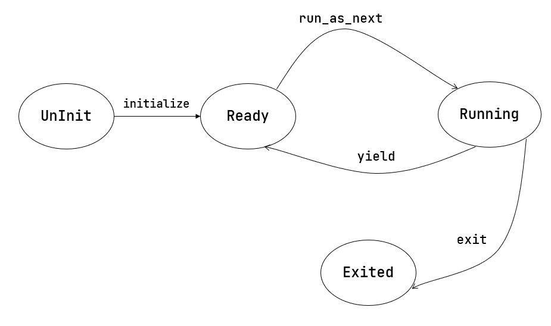

## 导读

提高操作系统性能与效率：

- 通过提前加载应用程序到内存，减少应用程序切换开销
- 通过协作机制支持程序主动放弃处理器，提高系统执行效率
- 通过抢占机制支持程序被动放弃处理器，保证不同程序对处理器资源使用的公平性，也进一步提高了应用对 I/O 事件的响应效率

内存容量在逐渐增大，处理器的速度也在增加，外设 I/O 性能方面的进展不大。这就使得以往内存只能放下一个程序的情况得到很大改善，但处理器的空闲程度加大了。于是科学家就开始考虑在内存中尽量同时驻留多个应用，这样处理器的利用率就会提高(在加载新的应用时，cpu基本在空闲，所以采用预加载)。

### 本章目标

实现这两种方案（并联）：

1. **多道程序**:内存中尽量同时驻留多个应用，这样处理器的利用率就会提高。但只有一个程序执行完毕后或主动放弃执行，处理器才能执行另外一个程序。

2. **分时共享（Time Sharing）** 或 **抢占式多任务（Multitasking）** ，也可合并在一起称为 **分时多任务** ：一个程序只能运行一段时间（可以简称为一个时间片, Time Slice）就一定会让出处理器。

**对于本章来说，多道程序和分时多任务系统都有一些共同的特点**：在内存中同一时间可以驻留多个应用，而且所有的应用都是在系统启动的时候分别加载到内存的不同区域中。

> [!note]
>
> **批处理与多道程序的区别是什么？**
>
> 对于批处理系统而言，它在一段时间内可以处理一批程序，但内存中只放一个程序，处理器一次只能运行一个程序，只有在一个程序运行完毕后再把另外一个程序调入内存，并执行。即批处理系统不能交错执行多个程序。
>
> 对于支持多道程序的系统而言，它在一段时间内也可以处理一批程序，但内存中可以放多个程序，一个程序在执行过程中，可以主动（协作式）或被动（抢占式）地放弃自己的执行，让另外一个程序执行。即支持多道程序的系统可以交错地执行多个程序，这样系统的利用率会更高。

获取多道程序的代码：

```bash
git clone https://github.com/rcore-os/rCore-Tutorial-v3.git
cd rCore-Tutorial-v3
git checkout ch3-coop
```

获取分时多任务系统的代码：

```bash
git clone https://github.com/rcore-os/rCore-Tutorial-v3.git
cd rCore-Tutorial-v3
git checkout ch3
```

### 任务图

#### 多道程序

##### 锯齿螈多道程序操作系统


通过上图，大致可以看出Qemu把包含多个app的列表和MultiprogOS的image镜像加载到内存中，RustSBI（bootloader）完成基本的硬件初始化后，跳转到MultiprogOS起始位置，MultiprogOS首先进行正常运行前的初始化工作，即建立栈空间和清零bss段，然后通过改进的 AppManager 内核模块从app列表中把所有app都加载到内存中，并按指定顺序让app在用户态一个接一个地执行。app在执行过程中，会通过系统调用的方式得到MultiprogOS提供的OS服务，如输出字符串等

##### 始初龙协作式多道程序操作系统


通过上图，大致可以看出相对于MultiprogOS，CoopOS进一步改进了 AppManager 内核模块，把它拆分为负责加载应用的 Loader 内核模块和管理应用运行过程的 TaskManager 内核模块。 TaskManager 通过 task 任务控制块来管理应用程序的执行过程，支持应用程序主动放弃 CPU  并切换到另一个应用继续执行，从而提高系统整体执行效率。应用程序在运行时有自己所在的内存空间和栈，确保被切换时相关信息不会被其他应用破坏。如果当前应用程序正在运行，则该应用对应的任务处于运行（Running）状态；如果该应用主动放弃处理器，则该应用对应的任务处于就绪（Ready）状态。操作系统进行任务切换时，需要把要暂停任务的上下文（即任务用到的通用寄存器）保存起来，把要继续执行的任务的上下文恢复为暂停前的内容，这样就能让不同的应用协同使用处理器了。

#### 分时多任务

##### 腔骨龙分时多任务操作系统


通过上图，大致可以看出相对于CoopOS，TimesharingOS最大的变化是改进了 Trap_handler 内核模块，支持时钟中断，从而可以抢占应用的执行。并通过进一步改进 TaskManager 内核模块，提供任务调度功能，这样可以在收到时钟中断后统计任务的使用时间片，如果任务的时间片用完后，则切换任务。从而可以公平和高效地分时执行多个应用，提高系统的整体效率.

位于 `ch3` 分支上的腔骨龙分时多任务操作系统 – TimesharingOS 的源代码如下所示：

这里

```
./os/src
Rust        18 Files   511 Lines
Assembly     3 Files    82 Lines

├── bootloader
│   └── rustsbi-qemu.bin
├── LICENSE
├── os
│   ├── build.rs
│   ├── Cargo.toml
│   ├── Makefile
│   └── src
│       ├── batch.rs(移除：功能分别拆分到 loader 和 task 两个子模块)
│       ├── config.rs(新增：保存内核的一些配置)
│       ├── console.rs
│       ├── entry.asm
│       ├── lang_items.rs
│       ├── link_app.S
│       ├── linker-qemu.ld
│       ├── loader.rs(新增：将应用加载到内存并进行管理)
│       ├── main.rs(修改：主函数进行了修改)
│       ├── sbi.rs(修改：引入新的 sbi call set_timer)
│       ├── sync
│       │   ├── mod.rs
│       │   └── up.rs
│       ├── syscall(修改：新增若干 syscall)
│       │   ├── fs.rs
│       │   ├── mod.rs
│       │   └── process.rs
│       ├── task(新增：task 子模块，主要负责任务管理)
│       │   ├── context.rs(引入 Task 上下文 TaskContext)
│       │   ├── mod.rs(全局任务管理器和提供给其他模块的接口)
│       │   ├── switch.rs(将任务切换的汇编代码解释为 Rust 接口 __switch)
│       │   ├── switch.S(任务切换的汇编代码)
│       │   └── task.rs(任务控制块 TaskControlBlock 和任务状态 TaskStatus 的定义)
│       ├── timer.rs(新增：计时器相关)
│       └── trap
│           ├── context.rs
│           ├── mod.rs(修改：时钟中断相应处理)
│           └── trap.S
├── README.md
├── rust-toolchain
└── user
    ├── build.py(新增：使用 build.py 构建应用使得它们占用的物理地址区间不相交)
    ├── Cargo.toml
    ├── Makefile(修改：使用 build.py 构建应用)
    └── src
        ├── bin(修改：换成第三章测例)
        │   ├── 00power_3.rs
        │   ├── 01power_5.rs
        │   ├── 02power_7.rs
        │   └── 03sleep.rs
        ├── console.rs
        ├── lang_items.rs
        ├── lib.rs
        ├── linker.ld
        └── syscall.rs
```

## 开始搞事情

本章：batch.rs被移除，

1. 应用的加载这部分功能分离出来在 `loader` 子模块中实现，
2. 应用的执行和切换功能则交给 `task` 子模块。

### 多道程序-锯齿螈

所有应用的 ELF 格式执行文件都经过 `objcopy` 工具丢掉所有 ELF header 和符号变为二进制镜像文件，随后以同样的格式通过在操作系统内核中嵌入 `link_user.S` 文件

`link_user.S`是储存app在`.data`里面的内容的地址，方便复制到`.test`里面

因为是静态链接,`user/bin`里面的应用被加载到绝对地址。如果，你在复制的时候不按照约定


为啥`user/`没有设置`mv sp ??`：因为应用程序实在Linux系统下的应用程序，他在运行时，已经被分配栈了

也发现了，目前使用的代码没有在`heap`分配的变量/目前还没有使用过堆

```bash
git checkout ch3_1
# 自己实现的第一个锯齿螈，但是运行不出来，链接和加载都对的，不知道为啥，先进行下面的动作吧
```


### 始初龙

#### 任务切换

第二章提及的 Trap 控制流切换之外的另一种异常控制流，都是描述两条控制流之间的切换，如果将它和 Trap 切换进行比较，会有如下异同：

- 与 Trap 切换不同，它不涉及特权级切换；
- 与 Trap 切换不同，它的一部分是由编译器帮忙完成的；
- 与 Trap 切换相同，它对应用是透明的。

事实上，任务切换是来自两个不同应用在内核中的 Trap 控制流之间的切换。当一个应用 Trap 到 S 模式的操作系统内核中进行进一步处理（即进入了操作系统的 Trap 控制流）的时候，其 Trap 控制流可以调用一个特殊的 `__switch` 函数。这个函数表面上就是一个普通的函数调用：在 `__switch` 返回之后，将继续从调用该函数的位置继续向下执行。但是其间却隐藏着复杂的控制流切换过程。具体来说，调用 `__switch` 之后直到它返回前的这段时间，原 Trap 控制流 *A* 会先被暂停并被切换出去， CPU 转而运行另一个应用在内核中的 Trap 控制流 *B* 。然后在某个合适的时机，原 Trap 控制流 *A* 才会从某一条 Trap 控制流 *C* （很有可能不是它之前切换到的 *B* ）切换回来继续执行并最终返回。

`__switch` 函数和一个普通的函数之间的核心差别仅仅是它会 **换栈**


- 阶段[1]:A,B都先进入内核态，所以都有一个`trap Handler stack`,然后sp指向A的内核栈
- 阶段[2]:cpu保存A的Trap上下文cx(寄存器快照)，记录current_task_cx_ptr.
- 阶段[3]:cpu获得B的Trap上下文cx(寄存器快照)，记录next_task_cx_ptr(including sp)
- 阶段[4]:切换sp

#### 任务状态

本节的一个重点是展示进一步增强的操作系统管理能力的和对处理器资源的相对高效利用。为此，对 **任务** 的概念进行进一步扩展和延伸：形成了

- 任务运行状态：任务从开始到结束执行过程中所处的不同运行状态：未初始化、准备执行、正在执行、已退出
- 任务控制块：管理程序的执行过程的任务上下文，控制程序的执行与暂停
- 任务相关系统调用：应用程序和操作系统之间的接口，用于程序主动暂停 `sys_yield` 和主动退出 `sys_exit`

这些都是三叠纪“始初龙”协作式操作系统需要具有的功能

 CPU 只能**单向**地通过读取外设提供的寄存器信息来获取外设处理 I/O 的完成状态。多道程序的思想在于：内核同时管理多个应用。如果外设处理  I/O 的时间足够长，那我们可以先进行任务切换去执行其他应用；在某次切换回来之后，应用再次读取设备寄存器，发现 I/O  请求已经处理完毕了，那么就可以根据返回的 I/O 结果继续向下执行了。这样的话，只要同时存在的应用足够多，就能一定程度上隐藏 I/O  外设处理相对于 CPU 的延迟，保证 CPU 不必浪费时间在等待外设上，而是几乎一直在进行计算。这种任务切换，是让应用 **主动** 调用 `sys_yield` 系统调用来实现的，这意味着应用主动交出 CPU 的使用权给其他应用。

会持续运行下去，直到它主动调用 `sys_yield` 系统调用来交出 CPU 使用权。内核将很大的权力下放到应用，让所有的**应用**互相协作来最终达成最大化 CPU  利用率，充分利用计算资源这一终极目标。在计算机发展的早期，由于应用基本上都是一些简单的计算任务，且程序员都比较遵守规则，因此内核可以信赖应用，这样协作式的方案是没有问题的。(协作式：应用自己退让)


>  [!important]
>
> **sys_yield的缺陷：**
>
> 当应用调用它主动交出 CPU 使用权之后，它下一次再被允许使用 CPU 的时间点与内核的调度策略与当前的总体应用执行情况有关，很有可能远远迟于该应用等待的事件（如外设处理完请求）达成的时间点。这就会造成该应用的响应延迟不稳定或者很长。

##### derive

> [!note]
>
> *通过 #[derive(...)] 可以让编译器为你的类型提供一些 Trait 的默认实现。*
>
> - 实现了 Clone Trait 之后就可以调用 clone 函数完成拷贝；
>
> - 实现了 PartialEq Trait 之后就可以使用 == 运算符比较该类型的两个实例，从逻辑上说只有 两个相等的应用执行状态才会被判为相等，而事实上也确实如此。
> - Copy 是一个标记 Trait，决定该类型在按值传参/赋值的时候采用移动语义还是复制语义.


