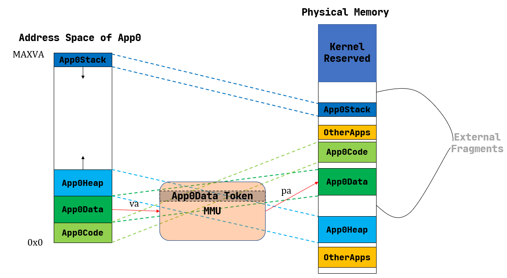
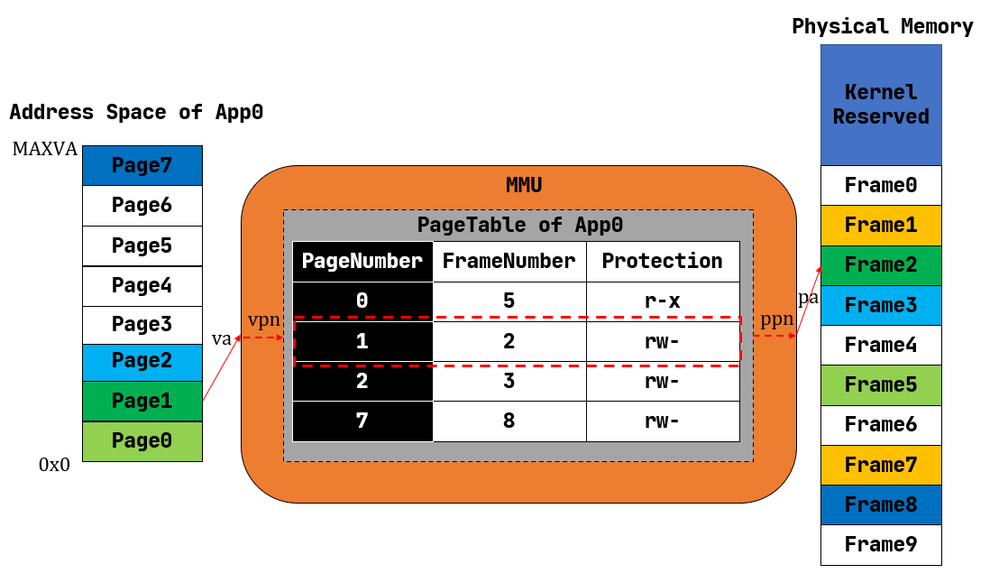
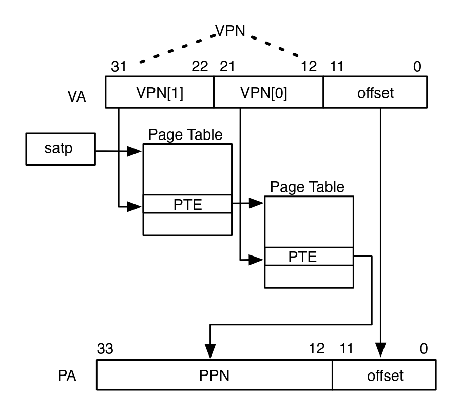

### 待定

```asm
	csrr 拿csr寄存器哦
	bnez 与0比大小
	li 加载立即数
	sw 放内存
	ld 加载到寄存器
	auipc pc加高位寄存器
	tail 尾调用 = PC加高位寄存器，再跳转
```

shadow stack，来保证函数返回时不会被恶意程序控制导致跳错位置。Clang此前支持shadow stack，被人报了问题之后就被移除了；GCC则从来没支持过

shadow是存的用户内存映射，无法访问内核映射，但是也不直接暴露给用户（我猜的）

[15题，看看Linux怎么写的](https://rcore-os.cn/rCore-Tutorial-Book-v3/chapter3/5exercise.html)

### 待解决

git如何设置某个文件夹，在任何一个分支，都保持同步


### 待理解

开始本章之前要掌握的

#### bitflags

## 开始新篇章

#### 目标

- 通过动态内存分配，提高了应用程序对内存的动态使用效率
- 通过页表的虚实内存映射机制，简化了编译器对应用的地址空间设置
- 通过页表的虚实内存映射机制，加强了应用之间，应用与内核之间的内存隔离，增强了系统安全
- 通过页表的虚实内存映射机制，可以实现空分复用（提出，但没有实现

### 侏罗纪“头甲龙” 操作系统

上章有趣的一点是，任务切换机制对于应用是完全 **透明** (Transparent) 的，应用可以不对内核实现该机制的策略做任何假定（除非要进行某些针对性优化），甚至可以完全不知道这机制的存在。

出于任务切换的需要，所有的应用都在初始化阶段被加载到内存中并同时驻留下去直到它们全部运行结束。而且，所有的应用都直接通过物理地址访问物理内存。带来的问题：

- 首先，内核提供给应用的内存访问接口不够透明，也不好用。由于应用直接访问物理内存，这需要它在构建的时候就清楚所运行计算机的物理内存空间布局，还需规划自己需要被加载到哪个地址运行。
- 其次，内核并没有对应用的访存行为进行任何保护措施，每个应用都有计算机系统中整个物理内存的读写权力。甚至它还可以修改内核的代码段来替换掉原本的 `trap_handler` 函数，来挟持内核执行恶意代码。总之，这造成系统既不安全、也不稳定。
- 目前应用的内存使用空间在其运行前已经限定死了，内核不能灵活地给应用程序提供的运行时动态可用内存空间。比如一个应用结束后，这个应用所占的空间就被释放了，但这块空间无法动态地给其它还在运行的应用使用。

本章将更好地管理物理内存，并提供给应用一个抽象出来的更加透明易用、也更加安全的访存接口，这就是基于分页机制的虚拟内存。实现地址空间的第一步就是实现分页机制，建立好虚拟内存和物理内存的页映射关系。

#### 引言

本章的应用和上一章相同，只不过由于内核提供给应用的访存接口被替换，应用的构建方式发生了变化，这方面在下面会深入介绍。 因此应用运行起来的效果与上一章是一致的。


通过上图，大致可以看出头甲龙操作系统 - Address Space OS为了提高操作系统和应用程序执行的安全性，增强了内存管理能力，提供了地址空间隔离机制，给APP的内存地址空间划界，不能越界访问OS和其他APP。在具体实现上，扩展了 TaskManager 的管理范围，每个 Task 的上下文 Task Context 还包括该任务的地址空间，在切换任务时，也要切换任务的地址空间。新增的内存管理模块主要包括与内核中动态内存分配相关的页帧分配、堆分配，以及表示应用地址空间的 Apps MemSets 类型和内核自身地址空间的Kernel MemSet类型。MemSet 类型所包含的页表 PageTable 建立了虚实地址映射关系，而另外一个 MemArea 表示任务的合法空间范围。	

```
./os/src
Rust        25 Files    1415 Lines
Assembly     3 Files      88 Lines

├── bootloader
│   ├── rustsbi-k210.bin
│   └── rustsbi-qemu.bin
├── LICENSE
├── os
│   ├── build.rs
│   ├── Cargo.lock
│   ├── Cargo.toml
│   ├── Makefile
│   └── src
│       ├── config.rs(修改：新增一些内存管理的相关配置)
│       ├── console.rs
│       ├── entry.asm
│       ├── lang_items.rs
│       ├── link_app.S
│       ├── linker-k210.ld(修改：将跳板页引入内存布局)
│       ├── linker-qemu.ld(修改：将跳板页引入内存布局)
│       ├── loader.rs(修改：仅保留获取应用数量和数据的功能)
│       ├── main.rs(修改)
│       ├── mm(新增：内存管理的 mm 子模块)
│       │   ├── address.rs(物理/虚拟 地址/页号的 Rust 抽象)
│       │   ├── frame_allocator.rs(物理页帧分配器)
│       │   ├── heap_allocator.rs(内核动态内存分配器)
│       │   ├── memory_set.rs(引入地址空间 MemorySet 及逻辑段 MemoryArea 等)
│       │   ├── mod.rs(定义了 mm 模块初始化方法 init)
│       │   └── page_table.rs(多级页表抽象 PageTable 以及其他内容)
│       ├── sbi.rs
│       ├── sync
│       │   ├── mod.rs
│       │   └── up.rs
│       ├── syscall
│       │   ├── fs.rs(修改：基于地址空间的 sys_write 实现)
│       │   ├── mod.rs
│       │   └── process.rs
│       ├── task
│       │   ├── context.rs(修改：构造一个跳转到不同位置的初始任务上下文)
│       │   ├── mod.rs(修改，详见文档)
│       │   ├── switch.rs
│       │   ├── switch.S
│       │   └── task.rs(修改，详见文档)
│       ├── timer.rs
│       └── trap
│           ├── context.rs(修改：在 Trap 上下文中加入了更多内容)
│           ├── mod.rs(修改：基于地址空间修改了 Trap 机制，详见文档)
│           └── trap.S(修改：基于地址空间修改了 Trap 上下文保存与恢复汇编代码)
├── README.md
├── rust-toolchain
├── tools
│   ├── kflash.py
│   ├── LICENSE
│   ├── package.json
│   ├── README.rst
│   └── setup.py
└── user
    ├── build.py(移除)
    ├── Cargo.toml
    ├── Makefile
    └── src
        ├── bin
        │   ├── 00power_3.rs
        │   ├── 01power_5.rs
        │   ├── 02power_7.rs
        │   └── 03sleep.rs
        ├── console.rs
        ├── lang_items.rs
        ├── lib.rs
        ├── linker.ld(修改：将所有应用放在各自地址空间中固定的位置)
        └── syscall.rs
```

#### 动态内存分配

在应用程序的视角中，动态内存分配中的内存，其实就是操作系统管理的“堆 （Heap）”。但现在要实现操作系统，那么就需要操作系统自身能提供动态内存分配的能力。如果要实现动态内存分配的能力，需要操作系统需要有如下功能：

- 初始时能提供一块大内存空间作为初始的“堆”
- 提供在堆上分配和释放内存的函数接口。这样函数调用方通过分配内存函数接口得到地址连续的空闲内存块进行读写。
- 提供空闲空间管理的连续内存分配算法。
- 提供建立在堆上的数据结构和操作。

为了在接下来的一些操作系统的实现功能中进一步释放 Rust 语言的强表达能力来减轻我们的编码负担，本节我们尝试在内核中支持动态内存分配，以能使用 Rust 核心库中各种灵活的动态数据结构，如 Vec、HashMap 等，且**不用人工考虑**这些数据结构的动态内存释放的繁琐操作，充分利用 Rust  语言保证的内存安全能力。

##### 静态分配

- 局部变量：栈
- 全局变量：数据段中

它们有一个共同点：在编译器编译程序时已经知道这些变量所占的字节大小，于是给它们分配一块固定的内存将它们存储其中，这样变量在栈帧/数据段中的位置就被固定了下来。

在完成本章之前，操作系统就没堆的概念，我们就没使用过堆。

##### 动态分配

应用另外放置了一个大小可以随着应用的运行动态增减的内存空间 –  堆（Heap）。同时，应用还要能够将这个堆管理起来，即支持在运行的时候从里面分配一块空间来存放变量，而在变量的生命周期结束之后，这块空间需要被回收以待后面的使用。如果堆的大小固定，那么这其实就是一个连续内存分配问题，同学们可以使用操作系统课上所介绍到的各种连续内存分配算法。一般情况下，应用所依赖的基础系统库（如 Linux 中的 glibc 库等）会直接通过系统调用（如类 Unix 内核提供的 `sbrk` 系统调用）来向内核请求增加/缩减应用地址空间内堆的大小，之后应用就可以基于**基础系统库提供的内存分配/释放函数来获取和释放内存**了。应用进行多次不同大小的内存分配和释放操作后，会产生内存空间的浪费，即存在无法被应用使用的空闲内存碎片。

动态分配还允许我们以尽可能小的代价灵活调整变量的生命周期。一个局部变量被静态分配在它所在函数的栈帧中，一旦函数返回，这个局部变量的生命周期也就结束了；而静态分配在数据段中的全局变量则是在应用的整个运行期间均存在。动态分配允许我们构造另一种并不一直存在也不绑定于函数调用的变量生命周期：以 C 语言为例，可以说自 `malloc` 拿到指向一个变量的指针到 `free` 将它回收之前的这段时间，这个变量在堆上存在。由于需要跨越函数调用，我们需要作为堆上数据代表的变量在函数间以参数或返回值的形式进行传递，而这些变量一般都很小（如一个指针），其拷贝开销可以忽略。

鉴于动态分配是一项非常基础的功能，很多高级语言的系统标准库中都实现了它。以 C 语言为例，C 标准库中提供了如下两个动态分配 的接口函数：

```C
void* malloc (size_t size);
void free (void* ptr);
```

> [!caution]
>
> RefCell 是 Rust 中的一种智能指针，它允许在拥有不可变引用的同时修改数据。RefCell 的内部机制涉及到了一个称为 `UnsafeCell` 的类型，它允许在编译时违反 Rust 的借用规则，从而实现所谓的内部可变性。尽管 RefCell 提供了运行时的借用检查，但它并不改变数据所在的内存位置，无论是堆上还是栈上。
>
> 在大多数情况下，RefCell 中的数据是存储在栈上的，除非它包含的数据类型本身是一个指针类型，这种情况下，RefCell 管理的是指针指向的内存，这部分内存可能位于堆上。例如，如果您有一个 RefCell 包含一个 `Vec<usize>`，那么 `Vec` 本身及其数据会在栈上分配，但 `Vec` 所管理的动态数组会在堆上分配.

<details>
    <summary>堆指针讲解</summary>
    在 Rust 中，与动态内存分配相关的智能指针主要有如下这些：<br>
   Box&lt;T&gt; 在创建时会在堆上分配一个类型为 T 的变量，它自身也只保存在堆上的那个变量的位置。而和裸指针或引用不同的是，当 Box&lt;T&gt; 被回收的时候，它指向的那个变量（位于堆上）也会被回收。Box&lt;T&gt; 可以对标 C++ 的 std::unique_ptr 。<br>
    Rc&lt;T&gt; 是一个单线程上使用的引用计数类型，它提供了多所有权支持，即可同时存在多个智能指针指向同一个堆上变量的 Rc&lt;T&gt; ，它们都可以拿到指向变量的不可变引用来访问这同一个变量。而它同时也是一个引用计数，事实上在堆上的另一个位置维护了这个变量目前被引用的次数 N ，即存在 N 个 Rc&lt;T&gt; 智能指针。这个计数会随着 Rc&lt;T&gt; 智能指针的创建或复制而增加，并在 Rc&lt;T&gt; 智能指针生命周期结束时减少。当这个计数变为零之后，这个智能指针变量本身以及被引用的变量都会被回收。 Arc&lt;T&gt; 与 Rc&lt;T&gt; 功能相同，只是 Arc&lt;T&gt; 可以在多线程上使用。 Arc&lt;T&gt; 类似于 C++ 的 std::shared_ptr 。<br>
    RefCell&lt;T&gt; 与 Box&lt;T&gt; 等智能指针不同，其 借用检查 在运行时进行。对于 RefCell&lt;T&gt; ，如果违反借用规则，程序会编译通过，但会在运行时 panic 并退出。使用 RefCell&lt;T&gt; 的好处是，可在其自身是不可变的情况下修改其内部的值。在Rust语言中，在不可变值内部改变值是一种 内部可变性 的设计模式。<br>
    Mutex&lt;T&gt; 是一个互斥锁，在多线程中使用。它可以保护里层的堆上的变量同一时间只有一个线程能对它进行操作，从而避免数据竞争，这是并发安全的问题，会在后面详细说明。同时，它也能够提供 内部可变性 。Mutex&lt;T&gt; 时常和 Arc&lt;T&gt; 配套使用，因为它是用来保护多线程（线程概念在后面会讲，这里可简单理解为运行程序）可同时访问的数据，其前提就是多个线程都拿到指向同一块堆上数据的 Mutex&lt;T&gt; 。于是，要么这个 Mutex&lt;T&gt; 作为全局变量被分配到数据段上，要么将 Mutex&lt;T&gt; 包裹上一层多所有权 Arc ，变成 Arc&lt;Mutex&lt;T&gt;&gt; 这种经典组合结构，让最里层基于泛型 T 数据结构的变量可以在线程间安全传递。<br>
    在讲解 同步互斥 之前我们通过 RefCell&lt;T&gt; 来获得内部可变性。可以将 Mutex&lt;T&gt; 看成 RefCell&lt;T&gt; 的多线程版本， 因为 RefCell&lt;T&gt; 是只能在单线程上使用的。而且 RefCell&lt;T&gt; 并不会在堆上分配内存，它仅用于基于数据段的静态内存分配。
</details>

对于 Rust 而言，我们可以直接使用以下容器：

- 向量 `Vec<T>` 类似于 C++ 中的 `std::vector` ；
- 键值对容器 `BTreeMap<K, V>` 类似于 C++ 中的 `std::map` ；
- 有序集合 `BTreeSet<T>` 类似于 C++ 中的 `std::set` ；
- 链表 `LinkedList<T>` 类似于 C++ 中的 `std::list` ；
- 双端队列 `VecDeque<T>` 类似于 C++ 中的 `std::deque` 。
- 变长字符串 `String` 类似于 C++ 中的 `std::string` 。

上述与堆相关的智能指针或容器都可以在 Rust 自带的 `alloc` crate 中找到。`alloc` 库需要我们提供给它一个 `全局的动态内存分配器` ，它会利用该分配器来管理堆空间，从而使得与堆相关的智能指针或容器数据结构可以正常工作。具体而言，我们的动态内存分配器需要实现它提供的 `GlobalAlloc` Trait，这个 Trait 有两个必须实现的抽象接口：

```rust
// alloc::alloc::GlobalAlloc

pub unsafe fn alloc(&self, layout: Layout) -> *mut u8;
pub unsafe fn dealloc(&self, ptr: *mut u8, layout: Layout);
```

两个接口中都有一个 `alloc::alloc::Layout` 类型的参数， 它指出了分配的需求，分为两部分:

- 所需空间的大小 `size` ，以及返回地址的对齐要求 `align` 。这个对齐要求必须是一个 2 的幂次，单位为字节数
- 限制返回的地址必须是 `align` 的倍数。

> [!note]
>
> 在 C 语言中，所有对齐要求的最大值是一个平台相关的常数（比如 8 bytes）.
>
> 但是Rust某些分配的对齐会很大，所以实现要复杂一点

然后只需将我们的动态内存分配器类型实例化为一个全局变量，并使用 `#[global_allocator]` 语义项标记即可。由于该分配器的实现比较复杂，我们这里直接使用一个已有的伙伴分配器实现。首先添加 crate 依赖：

```toml
# os/Cargo.toml

buddy_system_allocator = "0.6"
```

具体关于堆的分配可以看：[堆的建立与使用](https://os.phil-opp.com/heap-allocation/#local-and-static-variables)

#### 地址空间

计算机硬件引入了各种内存保护/映射/地址转换硬件机制，如 RISC-V 的基址-边界翻译和保护机制、x86 的分段机制、RISC-V/x86/ARM 都有的分页机制。如果在地址转换过程中，无法找到物理地址或访问权限有误，则处理器产生非法访问内存的异常错误。

- 应用程序提供统一的虚拟内存访问接口
- 并在内核中建立虚实地址空间的映射机制，给应用程序提供一个基于地址空间的安全虚拟内存环境，

虚拟内存的目标：

- *透明* ：应用开发者可以不必了解底层真实物理内存的硬件细节，且在非必要时也不必关心内核的实现策略， 最小化他们的心智负担；
- *高效* ：这层抽象至少在大多数情况下不应带来过大的额外开销；
- *安全* ：这层抽象应该有效检测并阻止应用读写其他应用或内核的代码、数据等一系列恶意行为。

操作系统要达到地址空间抽象的设计目标，需要有计算机硬件的支持，这就是计算机组成原理课上讲到的 `MMU` 和 `TLB` 等硬件机制。

操作系统内核如何规划应用数据放在物理内存的位置，而 MMU 又如何进行地址转换也都是不同的。下面我们简要介绍几种曾经被使用的策略，并探讨它们的优劣。

##### APP分配管理


优点：

MMU 只需要  两个寄存器，在地址转换进行比较或加法运算即可；而内核只需要在任务切换时完成切换  寄存器。在对一个应用的内存管理方面，只需考虑一组插槽的占用状态，可以用一个 **位图** (Bitmap) 来表示，随着应用的新增和退出对应置位或清空。

缺点：

产生内碎片

##### 分段内存管理



优点：

更小的粒度，没了内碎片

缺点：

产生繁多的外碎片

需要更多的寄存器

##### 分页内存管理



我们给每个虚拟页面和物理页帧一个编号，分别称为 **虚拟页号** (VPN, Virtual Page Number) 和 **物理页号** (PPN, Physical Page Number) 。每个应用都有一个表示地址映射关系的 **页表** (Page Table) 。

当 MMU  进行地址转换的时候，虚拟地址会分为两部分（虚拟页号，页内偏移），MMU首先找到虚拟地址所在虚拟页面的页号，然后查当前应用的页表，根据虚拟页号找到物理页号；最后按照虚拟地址的页内偏移，给物理页号对应的物理页帧的起始地址加上一个偏移量，这就得到了实际访问的物理地址。

在页表中，还针对虚拟页号设置了一组保护位，它限制了应用对转换得到的物理地址对应的内存的使用方式。最典型的如 `rwx`。读，写，取指执行。比如：应用修改只读的代码段，或者从数据段取指令来执行。

当一个应用的地址空间比较大的时候，页表中的项数会很多，已经不再是像之前那样数个寄存器便可存下来的了，CPU 内也没有足够的硬件资源能够将它存下来，因此它只能作为一种被内核管理的数据结构放在内存中，但是 CPU 也会直接访问它来查页表，这也就需要内核和硬件之间关于页表的内存布局达成一致。

优点：

更小的内外碎片

#### SV39多页机制的硬件机制

本节主要讲解在 RISC-V 64 架构下：

- 虚拟地址与物理地址的访问属性（可读，可写，可执行等），
- 组成结构（页号，帧号，偏移量等），
- 访问的空间范围，
- 硬件实现地址转换的多级页表访问过程等，
- 以及如何用Rust语言来设计有类型的页表项。

##### 补充(riscv-pdf里面的)

启用分页时，大多数地址（包括取数和存数的有效地址和 PC）都是虚拟地址，必须将其翻译成物理地址才能访问物理内存，翻译过程需要遍历一种称为`页表`的多叉树。页表的`叶子节点`指示虚拟地址是否已被映射到一个物理页:

- 若是，则该叶子节点还额外指示可访问该页的特权模式和访问类型。
- 访问未映射页或特权级不足将触发页故障异常（page fault exception）。


- V位：PTE其他字段是否有效
- R/W/X:可读，可写，可执行。
- U: `1`=用户态可读，内核态不行；`0`=内核态可读，用户不可读；
- G:是否全局映射(操作系统页)
- A：自上次清除后，是否访问
- D：自上次清除后，是否写入
- RSW：操作系统使用(RSW是留给S特权级软件（也就是内核）自行决定如何使用的，比如可以用它实现一些页面置换算法。)

> 上面U有个例外：
>
> 页表项的`U`位的描述不太完善， 在`Risc-v`的特权级文档中`U`位还有其他的补充描述，当`sstatus`寄存器中的`SUM`位置1，`S` 特权级可以访问`U`位为`1`的页，但是`S`特权级的程序常运行在`SUM`位清空的条件下，如果`S`特权级直接访问会出现`page fault`.
>
> 但是目前的实现是内核和应用使用两个不同的页表，所以大概不会有在内核中直接通过虚拟地址访问应用数据的情况啊。除非你的实现是每个进程一个页表，包括内核态和用户态两部分，这个时候才需要考虑设置SUM位。
>
> - 内核页表 + 多个APP的应用页表
> - 多个进程：一个内核页表  + 一个用户页表

除了 `G` 外的上述位可以被操作系统设置，只有 `A` 位和 `D` 位会被处理器动态地直接设置为 `1`

分页机制由一个名为 satp（Supervisor Address Translation and Protection，监管模式地址翻译和保护）的 S 模式 CSR 控制.

- MODE 字段用于开启分页并选择页表级数。
- ASID（AddressSpace Identifier，地址空间标识）字段是可选的，可用于降低上下文切换的开销。ASID只要是涉及**进程**需要考虑的
- 最后，PPN 字段以4 KiB页为单位存放`根页表`的物理页号。
- 通常 M 模式软件在第一次进入 S 模式前会将 satp 清零以关闭分页，然后 S 模式软件在创建页表后将正确设置 satp 寄存器。在我们切换任务的时候， `satp` 也必须被同时切换。

RV32 = 32系统

RV39 = 64系统,理论得到的物理地址为56位，但是虚拟与物理的上限不重要

RV39与RV32差不多，但是变成了三级页表...（就PPN拓展了）

> Sv39 要求地址的 63–39 位与第 38 位一致。




> [!note]
>
> 若所有取指、读数和存数操作均引入多次页表访问，则分页将大幅降低性能！所有现代处理器成本都用一个地址翻译缓存 （通常称为 TLB（Translation Lookaside Buffer，转译后备缓冲器））来降低上述开销。**为降低 TLB 本身的开销，大多数处理器并不自动维护它与页表的一致性，也即，若操作系统修改页表，则 TLB 的内容将过时**。为解决此问题，S 模式添加了另一条指令：sfence.vma 通知处理器软件可能已修改页表，故处理器可相应地冲刷 TLB。该指令有两个可选参数，用于指定刷新 TLB 的范围：rs1 指示软件修改了页表中的哪个虚拟地址翻译结果，rs2 指示被修改页表对应进程的地址空间标识（ASID）。若二者均为 x0，处理器将冲刷整个 TLB。

指令的硬件线程的地址翻译部件。当硬件线程修改了另一个硬件线程正在使用的页表时，前者必须用处理器间中断通知后者执行 sfence.vma指令。此过程通常称为 `TLB 击落`。

> mtime如果大于mtimecpp,就会一直触发中断。

##### 介绍

> [!note]
>
> **Rust Tips：类型转换之 From 和 Into**
>
> 一般而言，当我们为类型 `U` 实现了 `From<T>` Trait 之后，可以使用 `U::from(_: T)` 来从一个 `T` 类型的实例来构造一个 `U` 类型的实例；而当我们为类型 `U` 实现了 `Into<T>` Trait 之后，对于一个 `U` 类型的实例 `u` ，可以使用 `u.into()` 来将其转化为一个类型为 `T` 的实例。
>
> 当我们为 `U` 实现了 `From<T>` 之后，Rust 会自动为 `T` 实现 `Into<U>` Trait，因为它们两个本来就是在做相同的事情。因此我们只需相互实现 `From` 就可以相互 `From/Into` 了。
>
> 需要注意的是，当我们使用 `From` Trait 的 `from` 方法来构造一个转换后类型的实例的时候，`from` 的参数已经指明了转换前的类型，因而 Rust 编译器知道该使用哪个实现；而使用 `Into` Trait 的 `into` 方法来将当前类型转化为另一种类型的时候，它并没有参数，因而函数签名中并没有指出要转化为哪一个类型，则我们必须在其它地方 *显式* 指出目标类型。比如，当我们要将 `u.into()` 绑定到一个新变量 `t` 的时候，必须通过 `let t: T` 显式声明 `t` 的类型；又或是将 `u.into()` 的结果作为参数传给某一个函数，那么由于这个函数的函数签名中指出了传入位置的参数的类型，所以 Rust 编译器也就明确知道转换的类型。

root -> 二级页表 -> 叶结点(三级页表)

在这里我们给出 SV39 中的 `R/W/X` 组合的含义：


非叶节点（页目录表，非末级页表）的表项标志位含义和叶节点（页表，末级页表）相比有一些不同：

- 当 `V` 为 0 的时候，代表当前指针是一个空指针，无法走向下一级节点，即该页表项对应的虚拟地址范围是无效的；
- 只有当 `V` 为1 且 `R/W/X` 均为 0 时，表示是一个合法的页目录表项，其包含的指针会指向下一级的页表；
- 注意: 当 `V` 为1 且 `R/W/X` 不全为 0 时，表示是一个合法的页表项(非末级页表 + 叶结点)，其包含了虚地址对应的物理页号。

> [!note]
>
> **大页**
>
> 在 SV39 中，如果使用了一级页索引就停下来，则它可以涵盖虚拟页号的高  位为某一固定值的所有虚拟地址，对应于一个  的大页；如果使用了二级页索引就停下来，则它可以涵盖虚拟页号的高  位为某一固定值的所有虚拟地址，对应于一个  的大页。以同样的视角，如果使用了所有三级页索引才停下来，它可以涵盖虚拟页号的高  位为某一个固定值的所有虚拟地址，自然也就对应于一个大小为  的虚拟页面。
>
> 大页就是，某一块足够的连续区域，里面放着相同权限的信息，然后不用递归更大的深度去找页表项，在大页里面直接进行页内偏移(每个应用都有自己的页表项)

> 分析SV39多级页表的内存占用
>
> [网页](https://rcore-os.cn/rCore-Tutorial-Book-v3/chapter4/3sv39-implementation-1.html)
>
> 

**SV39虚拟地址转换方式**：


##### 最后

如果修改了 satp 寄存器，说明内核切换到了一个与先前映射方式完全不同的页表。此时快表里面存储的映射已经失效了，这种情况下内核要在修改 satp 的指令后面马上使用 sfence.vma 指令刷新清空整个 TLB。

同样，我们手动修改一个页表项之后，也修改了映射，但 TLB 并不会自动刷新清空，我们也需要使用 sfence.vma 指令刷新整个 TLB。注：可以在 sfence.vma 指令后面加上一个虚拟地址，这样 sfence.vma 只会刷新TLB中关于这个虚拟地址的单个映射项。

#### 管理SV39多级页表

本节我们主要讲解基于 SV39 多级页表机制的操作系统内存管理

`RefMut<'a, T>` 的 `drop` 方法会将独占借用权交出：正好说明了为啥要`drop(inner)`。当最初的T除了生命周期，正好把他drop了,一个是Rust的drop，一个是可以自定义的drop.这里描述不准确，就是根drop时，直接叫所有权给编译器回收。

`FrameTracker` 的`drop`设计也是基于同样的思想，有了它之后我们就不必手动回收物理页帧了，这在编译期就解决了很多潜在的问题。

##### 很诡异的报错

最初写这个代码的时候没有考虑`init_frame_allocator`,导致我再执行`frame_alloc()`的时候很奇妙的遇到了`File:src/sync/up.rs:30,cause:already borrowed: BorrowMutError`错误，这个错误目前**不可复现**。但是我找到另一种触发这种错误的方式：

```rust
////////// os/src/main.rs
// 已经加入：
init_frame_allocator()

////////// os/src/mm/frame_allocator.rs

pub fn frame_alloc() -> Option<FrameTracker>{    
    // 书写方式1
    FRAME_ALLOCATOR.exclusive_access()
    .alloc().map(|ppn| FrameTracker::new(ppn));
	None
    // 书写方式2
    let t = FRAME_ALLOCATOR.exclusive_access()
    .alloc().map(|ppn| FrameTracker::new(ppn));
	None
}
```

这个代码如果采用书写方式2,仍然无法触发问题，但是如果用书写方式1,会报错。原因如下：

`alloc`之后会得到一个正确的ppn,然后给闭包，闭包在new之后，相返回，没有接受值，直接drop,此时由于Rust编译器的`剥洋葱`编译方式，FRAME_ALLOCATOR.exclusive_access()还没被回收，此时drop又会FRAME_ALLOCATOR.exclusive_access()。

但是如果方式2：

`FRAME_ALLOCATOR.exclusive_access().alloc().map(|ppn| FrameTracker::new(ppn))`之后，`FRAME_ALLOCATOR.exclusive_access()`归还所有权，释放；但是`let t = map(|ppn| FrameTracker::new(ppn))`导致这个东西所有权在函数里。(这个FrameTracker结构体是clone，不需要所有权的)

##### 恒等映射实现

页表映射只需要：

比如你想访问物理地址为pn的地址，只需要保证页表中存在一个虚拟地址va,而且`va -> pn`,然后访问为允许，那么这种访问就成立。(**这种映射方式，也导致裸指针能正常使用，指向的虚拟地址等于物理地址**)

基于上方原理，可以实现一种最简单的映射方式：

> 每个物理页帧的物理页号 `ppn` ，均存在一个对应的虚拟页号 `vpn` ，这需要建立一种映射关系。这里我们采用一种最简单的 **恒等映射** (Identical Mapping) ，即对于物理内存上的每个物理页帧，我们都在多级页表中用一个与其物理页号相等的虚拟页号来映射。
>
> 还有比较著名的[页表自映射](https://os.phil-opp.com/paging-implementation/#accessing-page-tables)

##### 内核中访问物理页帧的方法

我们在返回值类型上附加了静态生命周期泛型 `'static` ，这是为了绕过 Rust 编译器的借用检查，实质上可以将返回的类型也看成一个裸指针，因为它也只是标识数据存放的位置以及类型。但与裸指针不同的是，无需通过 `unsafe` 的解引用访问它指向的数据，而是可以像一个正常的可变引用一样直接访问。	

> [!note]
>
> **unsafe 真的就是“不安全”吗？**
>
> 下面是笔者关于 unsafe 一点较为深入的讨论，不感兴趣的同学可以跳过。
>
> 当我们在 Rust 中使用 unsafe 的时候，并不仅仅是为了绕过编译器检查，更是为了告知编译器和其他看到这段代码的程序员：“ **我保证这样做是安全的** ” 。尽管，严格的 Rust 编译器暂时还不能确信这一点。从规范 Rust 代码编写的角度，我们需要尽可能绕过 unsafe ，因为如果  Rust  编译器或者一些已有的接口就可以提供安全性，我们当然倾向于利用它们让我们实现的功能仍然是安全的，可以避免一些无谓的心智负担；反之，就只能使用  unsafe ，同时最好说明如何保证这项功能是安全的。
>
> 这里简要从内存安全的角度来分析一下 `PhysPageNum` 的 `get_*` 系列方法的实现中 `unsafe` 的使用。首先需要指出的是，当需要访问一个物理页帧的时候，我们需要从它被绑定到的 `FrameTracker` 中获得其物理页号 `PhysPageNum` 随后再调用 `get_*` 系列方法才能访问物理页帧。因此， `PhysPageNum` 介于 `FrameTracker` 和物理页帧之间，也可以看做拥有部分物理页帧的所有权。由于 `get_*` 返回的是引用，我们可以尝试检查引用引发的常见问题：第一个问题是 **==use-after-free==** 的问题，即是否存在 `get_*` 返回的引用存在期间被引用的物理页帧已被回收的情形；第二个问题则是注意到 `get_*` 返回的是可变引用，那么就需要考虑对物理页帧的**==访问读写冲突==**的问题。
>
> 为了解决这些问题，我们在编写代码的时候需要额外当心。对于每一段 unsafe 代码，我们都需要认真考虑它会对其他无论是 unsafe 还是 safe 的代码造成的潜在影响。比如为了避免第一个问题，我们需要保证当完成物理页帧访问之后便立即回收掉 `get_*` 返回的引用，至少使它不能超出 `FrameTracker` 的生命周期；考虑第二个问题，目前每个 `FrameTracker` 仅会出现一次（在它所属的进程中），因此它只会出现在一个上下文中，也就不会产生冲突。但是当内核态打开（允许）中断时，或内核支持在单进程中存在多个线程时，情况也许又会发生变化。
>
> 当编译器不能介入的时候，我们很难完美的解决这些问题。因此重新设计数据结构和接口，特别是考虑数据的所有权关系，将建模进行转换，使得 Rust 有能力检查我们的设计会是一种更明智的选择。这也可以说明为什么要尽量避免使用 unsafe 。事实上，我们目前 `PhysPageNum::get_*` 接口并非一个好的设计，如果同学有兴趣可以试着对设计进行改良，让 Rust 编译器帮助我们解决上述与引用相关的问题。

##### 内核与应用的物理地址

页表 `PageTable` 只能以页为单位帮助我们维护一个虚拟内存到物理内存的地址转换关系，它本身对于计算机系统的整个虚拟/物理内存空间并没有一个全局的描述和掌控。

